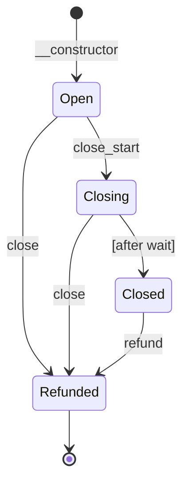

# Channel

A unidirectional payment channel contract for Soroban (Stellar).

A payment channel allows a funder to make many small payments to a recipient
off-chain, with only two on-chain transactions: opening the channel and
closing it. This avoids per-payment transaction fees and latency.

> [!WARNING]
> **The contracts in this repository have not been audited.**

## Participants

- **Funder (`from`)**: Deposits tokens into the channel and signs
  commitments authorizing the recipient to settle or close the channel
  and receive a given amount.
- **Recipient (`to`)**: Receives commitments off-chain and can settle or
  close the channel on-chain at any time using a signed commitment.

## Expectations

Participants have the following responsibilities to receive the funds owing
to them.

### Funder

- Keeping the private key corresponding to `commitment_key` (the commitment signing key) secret.

### Recipient

- Verifies the `refund_waiting_period` at channel creation is long
  enough to allow them to react to a close_start event.
- Verifies, against the chain, that the channel was deployed by the
  expected factory with the expected token, `to`, and `commitment_key`,
  and that no close has started, before accepting any commitment.
- Verifies the `amount` in each commitment does not exceed the channel's
  `deposited` total. The contract rejects larger commitments, so a
  commitment beyond `deposited` is worthless.
- Keeps the commitment with the highest `amount`. Older commitments stay
  valid signatures but are useless: settlement pays the cumulative
  `amount` minus what was already withdrawn.
- Monitors the channel for [`event::Close`] events.
- Calls `settle` with a commitment promptly after seeing a close_start
  event, before the funder calls `refund`.

## State diagram



`settle` can be called in any state before Refunded. `close` can be
called while Open, Closing, or Closed. `top_up` can only be called while
Open. `refund` can be called in Closed and Refunded.

## Functions

### Lifecycle

| Function | Description |
|---|---|
| `__constructor` | Open a channel with an initial deposit. Callable by the deployer, authorized by the funder. |
| `top_up` | Deposit additional tokens into the channel. |
| `extend` | Extend the lifetime (TTL) of the channel's storage. |
| `settle` | Withdraw funds using a signed commitment without closing the channel. |
| `close` | Close the channel using a signed commitment, withdrawing funds to the recipient. Automatically attempts to refund the funder. |
| `close_start` | Begin closing the channel, effective after a waiting period. |
| `refund` | Refund the remaining balance to the funder after the close is effective. |

### Helpers

| Function | Description |
|---|---|
| `prepare_commitment` | Generate the commitment bytes to sign. |

### Getters (static)

| Function | Description |
|---|---|
| `token` | Returns the token address. |
| `from` | Returns the funder address. |
| `to` | Returns the recipient address. |
| `refund_waiting_period` | Returns the refund waiting period in ledgers. |

### Getters (dynamic)

| Function | Description |
|---|---|
| `deposited` | Returns the total amount deposited. |
| `balance` | Returns the current balance. |
| `withdrawn` | Returns the total amount already withdrawn. |

## Lifecycle

### 1. Open

The channel is deployed with a SEP-41 token, funder address, recipient
address, an ed25519 `commitment_key` (public key), an initial deposit
amount, and a `refund_waiting_period` (in ledgers).

The funder's tokens are transferred into the channel contract on deployment.
The funder can also top up the channel later using [`Contract::top_up`].
Only these two paths count towards `deposited`, the ceiling for
commitments; tokens sent directly to the channel address are not deposits
and can only be reclaimed by the funder via `refund`.

### 2. Off-chain payments

The funder makes payments by signing commitments off-chain and sending them
to the recipient. A commitment authorizes the recipient to settle or
close the channel and receive a **cumulative total** amount. A newer
commitment supersedes an older one only in the sense that its amount is
higher; the older signature remains valid but pays nothing extra.

For example:
- Commitment for 100: recipient can settle or close and receive 100.
- Commitment for 140: recipient can settle or close and receive 140
  (40 more if 100 was already settled).

A commitment is an XDR serialized [`Commitment`] struct containing a domain
separator (`chancmmt`), the network ID, the channel contract address, and
the amount. The
funder signs the serialized bytes with the ed25519 key corresponding to the
`commitment_key`. Use [`Contract::prepare_commitment`] as a convenience to
generate the bytes to sign.

The serialized commitment is an XDR `ScVal::Map` with four entries
(sorted alphabetically by key):

```text
ScVal::Map({
    Symbol("amount"):  I128(amount),
    Symbol("channel"): Address(channel_contract_address),
    Symbol("domain"):  Symbol("chancmmt"),
    Symbol("network"): BytesN<32>(network_id),
})
```

### 3. Settle

The recipient calls [`Contract::settle`] at any time with a commitment
amount and its signature. The contract verifies the signature, then
transfers the difference between the commitment amount and what has
already been withdrawn. If the commitment amount is less than or equal
to what has already been withdrawn, no transfer occurs.

A commitment whose amount exceeds the channel's `deposited` total is
rejected outright. Nothing is transferred and nothing stays claimable:
the recipient must never accept a commitment beyond `deposited`.

Settlement is all-or-nothing: if the channel's token balance ever drops
below what a commitment needs (for example through an issuer clawback on
a token with `AUTH_CLAWBACK_ENABLED`, or a fee-on-transfer token), that
commitment can no longer be settled. The recipient should therefore only
accept channels denominated in a token whose issuer it trusts and whose
transfers move the exact amount.

Settlement is optional. The recipient does not need to settle at all —
[`Contract::close`] will also settle any unsettled amount. The recipient
may choose to settle periodically to receive funds without closing the
channel.

### 4. Close

The recipient calls [`Contract::close`] with a commitment amount and its
signature. Like `settle`, only the difference between the commitment
amount and what has already been withdrawn is transferred.

After transferring the committed funds, the close function automatically
attempts to refund the remaining balance to the funder. This refund attempt
uses `try_transfer` and will silently succeed or fail without affecting the
withdrawal. If the automatic refund fails, the funder can call
[`Contract::refund`] to reclaim the remaining balance.

Like `settle`, can be called after `close_start`, up until the funder
has been refunded. `close` itself makes the channel final: a second
`close` or a later `settle` is rejected. If the automatic refund failed,
the funder recovers the balance with [`Contract::refund`].

### 5. Close Start

The funder calls [`Contract::close_start`] to begin closing the channel.
The close does not take effect immediately — there is a waiting period of
`refund_waiting_period` ledgers.

The recipient can still call [`Contract::settle`] or [`Contract::close`]
during and after the waiting period. Once the waiting period has elapsed,
the funder can call `refund` to reclaim the remaining balance.

**Important:** The recipient should monitor for [`event::Close`] events and
settle or close before the funder calls `refund`.

### 6. Refund

After the refund waiting period has elapsed, the funder calls
[`Contract::refund`] to reclaim whatever balance remains in the channel.
This transfers the **entire** remaining token balance to the funder,
including any amount the recipient was entitled to but did not settle or
close for.
The contract does not reserve funds for the recipient. If the recipient
has not closed before the funder calls refund, those funds are lost to
the recipient and assumed to be of no interest to the recipient.

Refund makes the channel final. The recipient can no longer settle or
close, and the funder can no longer top up, so tokens that arrive
afterwards belong to the funder alone and are reclaimed with a further
`refund`. A closing channel likewise cannot be topped up, and tokens sent
directly to the address never raise `deposited`, so a channel is never
reused after a close has started.

## Storage lifetime

All channel state is stored in instance storage. State-changing functions
(`top_up`, `settle`, `close`, `close_start`) extend the storage TTL as a
side effect, and anyone can call [`Contract::extend`] to extend it
explicitly. A channel left idle for a long period can still have its
storage archived; it must then be restored before use.

## Security

- Commitments are signed with an ed25519 key, not a Stellar account. The
  `commitment_key` is set at deployment and cannot be changed.
- The commitment includes a domain separator, the network ID, and the
  channel contract address, preventing signatures from being reused across
  networks, channels, or confused with other signed payloads.
- The refund waiting period protects the recipient: it gives them time to
  settle or close using their latest commitment before the funder can
  reclaim funds.

# Channel Factory

A factory contract for opening channel contracts on Soroban (Stellar).

The factory stores a channel contract wasm hash and opens new channel
instances using it. An admin can update the wasm hash to open newer
versions of the channel contract.

## Functions

| Function | Description |
|---|---|
| `__constructor` | Initialize the factory with an admin and channel wasm hash. |
| `set_wasm` | Update the stored channel wasm hash. Admin only. |
| `open` | Deploy a new channel contract with the given parameters. The caller passes the expected channel wasm hash, which must match the stored one. |
| `admin` | Returns the admin address. |
| `wasm_hash` | Returns the stored channel wasm hash. |

# Account

A custom account contract for Soroban (Stellar) controlled by an EVM
(secp256k1) wallet key, such as a MetaMask account on Base or Ethereum.

> [!WARNING]
> **The contracts in this repository have not been audited.**

The contract stores a single 20-byte Ethereum address. Any Soroban
invocation that requires this account's authorization is approved by a
`personal_sign` (EIP-191) signature from the corresponding EVM key over
the Soroban authorization payload. This lets a user whose only key is an
EVM browser wallet act as a first-class Soroban address — for example as
the funder (`from`) of a payment channel — with no Stellar key at all.

Replay protection, nonces, expiration, and network binding are provided
by the Soroban authorization framework, which computes the 32-byte
`signature_payload` over the full invocation tree. This contract only
verifies that the payload was signed by the stored EVM address.

## Signed message format

The wallet signs the 66-character ASCII string `m = "0x" || lowercase_hex(payload)`
via `personal_sign`. The contract rebuilds `m` from the payload and verifies:

```text
digest = keccak256("\x19Ethereum Signed Message:\n66" || m)
ecrecover(digest, signature) == stored ethereum address
```

Note for SDKs: providers interpret a `0x`-prefixed `personal_sign` param as
hex data and sign the *decoded* bytes. To sign the 66 ASCII bytes of `m`,
pass `"0x" || hex(utf8_bytes(m))` (132 hex chars) at the RPC layer.

Signatures must be 65 bytes `r || s || v` with canonical low `s` and
`v` in {0, 1, 27, 28}. Only externally owned accounts are supported;
contract wallets (ERC-1271) cannot be verified.

## Functions

| Function | Description |
|---|---|
| `__constructor` | Store the controlling Ethereum address. Immutable thereafter. |
| `__check_auth` | Verify an EIP-191 signature over the authorization payload. |
| `eth_address` | Returns the controlling Ethereum address. |
| `extend` | Extend the lifetime (TTL) of the account's storage. |

# Account Factory

A factory contract for deploying account contracts on Soroban (Stellar).

> [!WARNING]
> **The contracts in this repository have not been audited.**

The factory deploys account contracts at deterministic addresses derived
from the controlling Ethereum address, so that an account's Soroban
address is computable before it is deployed, and so that the deployed
address is bound to its signer by construction.

There is intentionally no caller-supplied salt and no admin function to
change the stored account wasm hash: either would allow an attacker to
front-run a deployment and bind a user's computed address to a different
signer or different code. A new account wasm version requires deploying a
new factory, which derives distinct account addresses.

## Functions

| Function | Description |
|---|---|
| `__constructor` | Initialize the factory with an account contract wasm hash. Immutable thereafter. |
| `open_account` | Deploy the account contract for the given Ethereum address. |
| `account_address` | Returns the deterministic account address for the given Ethereum address. |
| `wasm_hash` | Returns the stored account wasm hash. |
